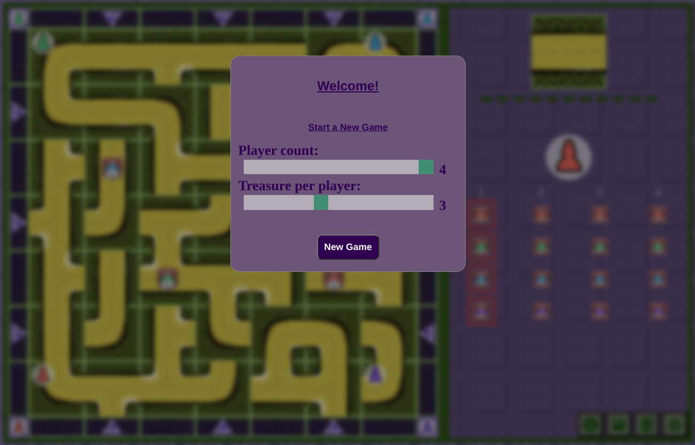
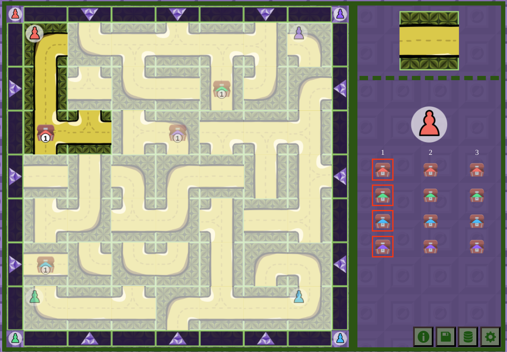
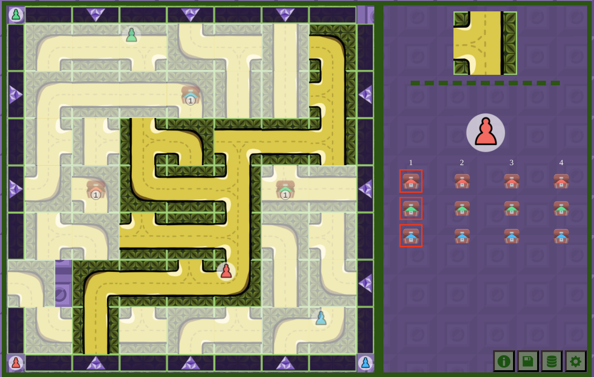
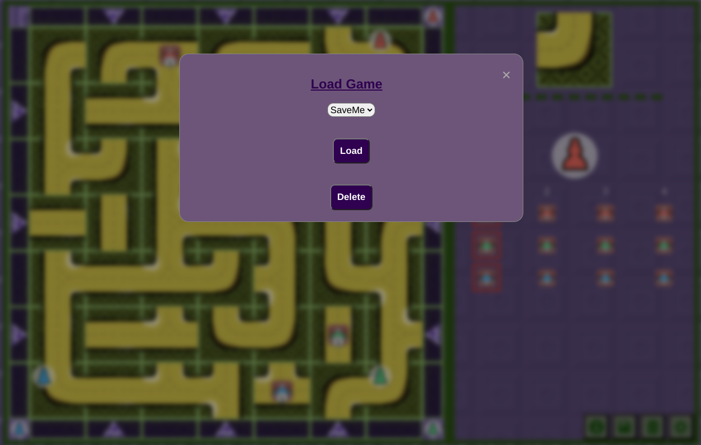

# Labyrinth

## About
Course project for **Web Programming**.
A multi-player game where players need to move fields in order to collect their treasures before anyone else does.

Written in JavaScript using MVC architecture. As part of it there are modularized view components (e.g. ```View/TableView```) which can support other table-based game development.

## Screenshots
<p float="left">




</p>